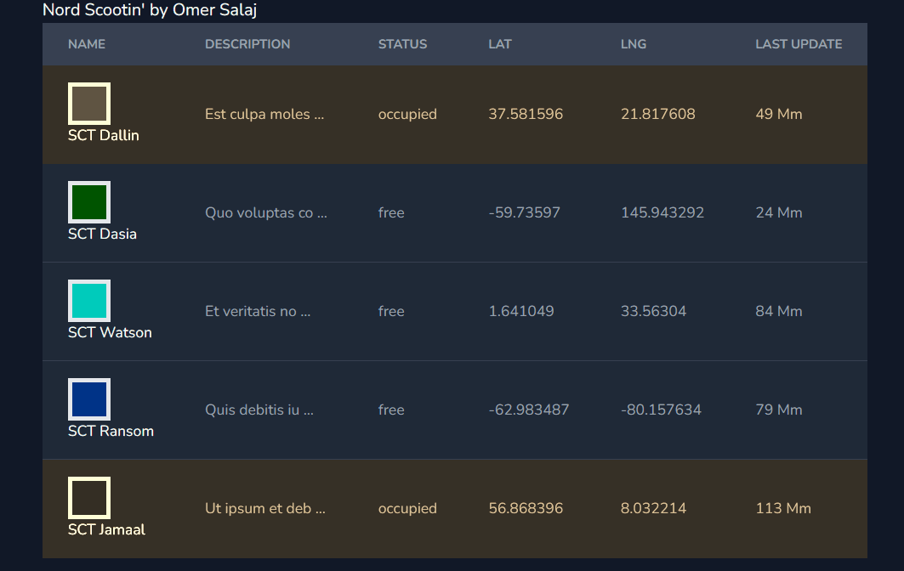

## Scootin

Scootin Laravel WebSockets example.

###### by Omer Salaj (omersalaj@gmail.com)

### Technologies

* PHP ^8.1
* MySQL ^8.0
* Laravel ^9.23
* Passport ^10.4.1
* Scribe ^3.35
* WebSockets
* VueJS, Axios, Tailwind and Vite

Make sure you have installed PHP (^8.1) and MySQL (^8.0) with the database named `scootin` and `scootin_test` up and
running.

If this is not a case, or you are more familiar with docker, then feel free to explore `docker-compose.yml`
and `devcontainer.json` file for Laravel Sail Docker Container (link below).
For the simplicity of this project, I will not use Docker in my documentation.

After cloning the repository into your working directory, follow the instructions down below.

0. To install the defined dependencies of the project, you should run the following command:

```
composer install
```

1. Copy .env.example file into .env and then populate it with your MySQL database credentials:

```
cp .env.example .env
```

After that you can run the command to create databases (will skip if exists).

```
php artisan db:create scootin && php artisan db:create scootin_test
```

2. Generate new application key:

```
php artisan key:generate
```

3. Create database tables and populate them with fresh data:

```
php artisan migrate:fresh --seed
```

4. Generate *Personal access client* and *Password grant client* keys for API usage:

```
php artisan passport:install --force
```

5. Install node modules and build assets with Vite

```
npm install && npm run dev
```

or even to run the "build" package script via `npm run build`

6. Start the *WebSocket* server and be sure that port *6001* is not being used.

```
php artisan websockets:serve
```

You can access Websocket dashboard by visiting http://127.0.0.1:8000/laravel-websockets

7. To spawn fake Client, run the following command

```
php artisan spawn:clients
```

There are some OS restrictions on spawning multiple child processes (on Windows), so please run the same command in
three separate terminals to simulate three fake clients API usage.

8. Finally, we can start the web server with:

```
php artisan serve --host=127.0.0.1 --port=8000
```

Then visit http://127.0.0.1:8000 via browser.
You should see something similar to this:



If you have problem reaching this page, try building assets for production with `npm run build`.
Sometimes clearing Laravel cache via `php artisan optimize:clear` may help.

9. Generate the Scribe API documentation with following command

```
php artisan scribe:generate
```

Then visit http://127.0.0.1:8000/docs#endpoints to explore and play around with API.
API can be easily tested and demonstrated via Scribe which is configured to support Bearer token as well.
On the left side menu you can find *OpenAPI spec* and *Postman collection* if needed.

10. There is one feature test that tests the capability of finding *Occupied* scooters in a specific area.
    To run the test, you need `scootin_test` database and then run the following command:

```
php artisan test
```

---

##### Laravel Sail:

If you are more familiar with Docker development environment than feel free to spin up Laravel Sail Docker Container.
More info at https://laravel.com/docs/9.x/sail

##### Postman invitation link:

https://app.getpostman.com/join-team?invite_code=09527108c029469e251ce196573219bb

*Thank you for reading.*
